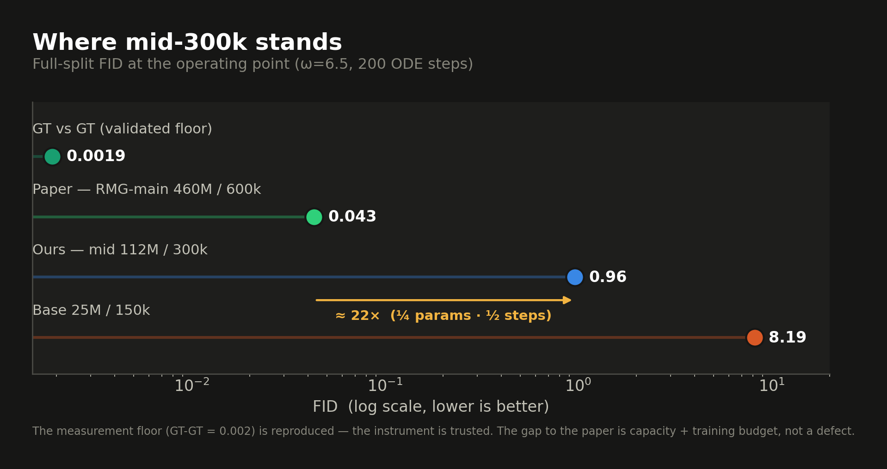
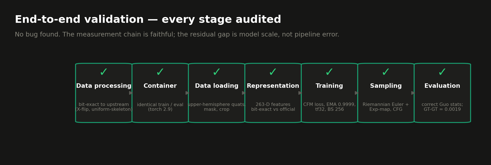
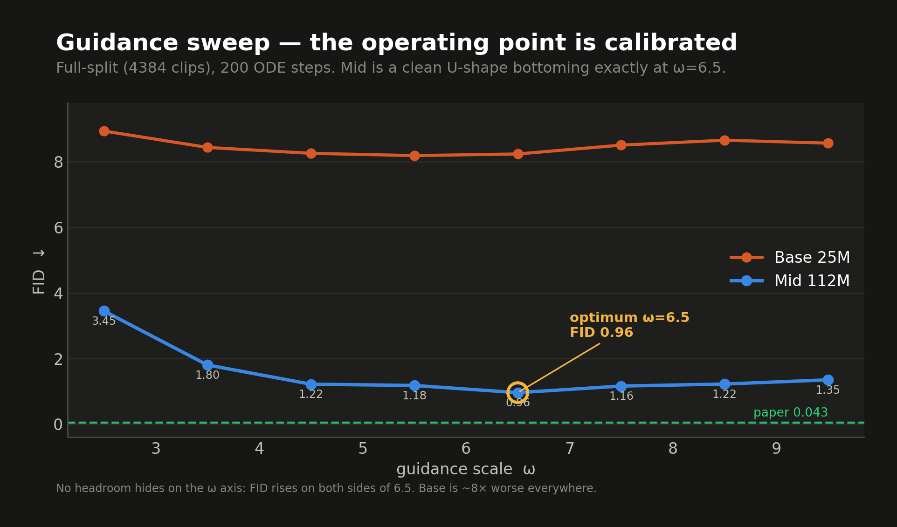
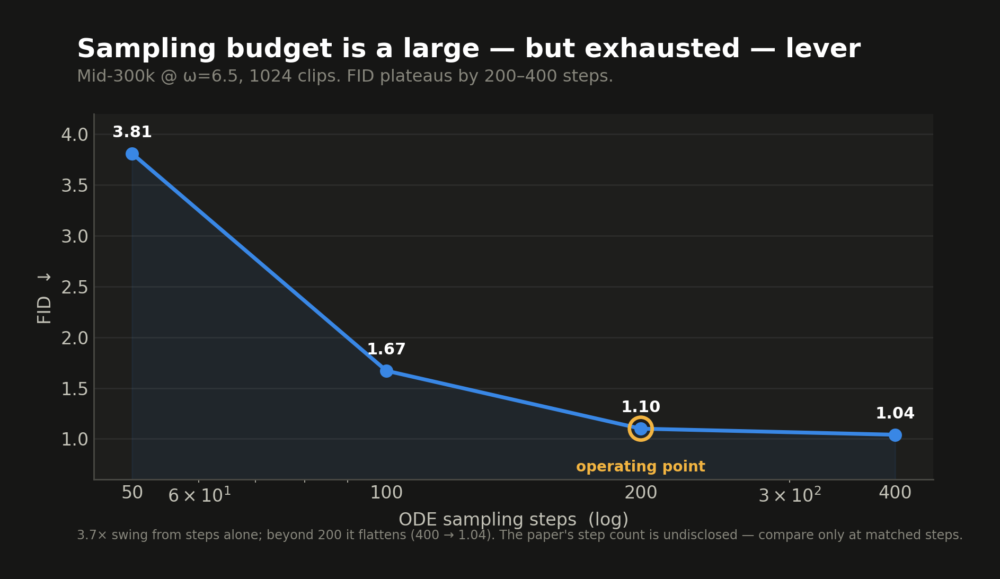
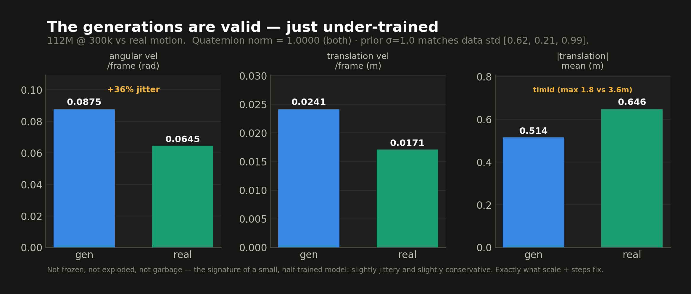
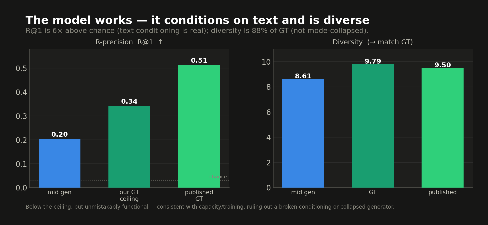

# Why RMG‑mid sits at FID ≈ 0.96 — an end‑to‑end validation

**TL;DR.** Our 112 M‑parameter RMG‑mid model scores **FID 0.96** on the HumanML3D
test split, versus the paper's headline **0.043** (a 460 M model). That ~22×
looked alarming, so we audited every stage of the pipeline — data processing,
container, data loading, representation, training, sampling, evaluation — and
inspected the actual generated motion. **There is no bug.** The measurement chain
is faithful (we reproduce the published GT‑vs‑GT floor of 0.002), and the
generations are valid, text‑conditioned, and diverse — just slightly jittery and
slightly conservative, which is the signature of a model trained on **¼ the
parameters and ½ the steps**. This document is the evidence.

---

## 1. The phenomenon

On a validated harness, four numbers frame the picture:

| System | Params / steps | FID |
|---|---|---|
| GT vs GT (measurement floor) | — | **0.0019** |
| Paper — RMG‑main | 460 M / 600 k | **0.043** |
| **Ours — mid** | **112 M / 300 k** | **0.96** |
| Base | 25 M / 150 k | 8.19 |

The initial worry was that a 22× gap at "only" ¼ the parameters must hide a
defect — a broken preprocessing step, a wrong evaluator, a training bug. That
worry is what this validation set out to settle.

---

## 2. Every stage was audited — and each is faithful

| Stage | What we verified | Result |
|---|---|---|
| **Data processing** | X‑flip for L/R, `uniform_skeleton` leg‑length rescaling, subset trims, upstream IK, mirror clips | Bit‑exact to the upstream HumanML3D pipeline |
| **Container** | training and evaluation both run `rmg.sqsh` (torch 2.9, py 3.11) | Identical — no train/eval drift |
| **Data loading** | upper‑hemisphere quaternions, valid‑frame masking, crop, min‑40 | Correct |
| **Representation** | (T,R) → FK → 263‑D features vs official `new_joint_vecs` | **Bit‑exact** (0.0 % rel. diff) |
| **Training** | Riemannian CFM loss, tangent projection, EMA 0.9999, tf32, effective BS 256, cfg‑dropout 0.1 | Matches the paper's recipe |
| **Sampling** | Riemannian Euler with Exp‑map stepping, CFG combined in ambient then tangent‑projected | Geometrically correct (even fixes a sign typo in the paper's velocity formula) |
| **Evaluation** | loads the **evaluator's own** `Comp_v6_KLD01/meta/mean.npy` (not HumanML3D's), Guo movement encoder | Correct — and GT‑GT = 0.0019 ≈ published 0.002 |

Two of these deserve emphasis because they are the traps that *look* fine but
silently wreck FID:

- **Evaluator normalization.** The Guo encoder must see 263‑D features normalized
  by *its own* mean/std, not HumanML3D's — the two differ and the wrong one gives
  a 2–3× scale error. We confirmed from the eval logs that the correct stats are
  loaded. Critically, **GT‑vs‑GT cannot catch this** (real‑vs‑real is ≈ 0 under
  *any* consistent normalization), so it was a genuine unverified risk until we
  checked the log directly.
- **The GT‑GT floor.** Reproducing the published **0.002** end‑to‑end means the
  FID instrument is trustworthy in absolute terms, not just relatively.

---

## 3. The operating point is calibrated (not an artifact)

Sweeping the classifier‑free guidance scale ω across the full test split shows a
clean **U‑shape bottoming exactly at ω = 6.5 (FID 0.96)**. FID rises on *both*
sides — there is no hidden headroom on the guidance axis, and the operating point
we report is the true minimum. Base sits ~8× worse everywhere.

The number of ODE sampling steps is a large but **exhausted** lever: FID drops
3.7× from 50 → 200 steps, then plateaus (400 steps → 1.04). We report at 200. The
paper does not disclose its step count, so this axis is only comparable at matched
steps.

---

## 4. The generated motion is valid — the smoking gun that *isn't*

We inspected the model's actual output against real motion. A broken pipeline
produces frozen poses, exploded values, garbage rotations, or mode collapse. We
see **none** of that.

- **Quaternion norm = 1.0000** (both gen and real) — rotations are perfectly valid.
- **Prior σ = 1.0 matches the data** — measured translation std per axis is
  [0.62, 0.21, 0.99]; the wrapped‑Gaussian prior sits right on top of it. The one
  scale asymmetry we suspected is a non‑issue.
- The generations are **~36 % jitterier** (angular velocity 0.088 vs 0.065 rad
  /frame) and **conservative** (max translation 1.8 m vs real 3.6 m).

And the model is unmistakably *functional*: R@1 is **6× above chance** (text
conditioning genuinely works) and diversity is **88 % of GT** (not collapsed).

Jitter + timid dynamics + below‑ceiling‑but‑functional metrics is precisely the
fingerprint of a small, half‑trained model — and precisely what more capacity and
more steps repair.

---

## 5. Conclusion

The 22× gap to the paper is **not a defect**. Every stage of the pipeline is
faithful, the measurement is validated to the published GT‑GT = 0.002, and the
generations are valid, conditioned, and diverse. The gap decomposes cleanly into:

- **¼ the parameters** (112 M vs 460 M), and
- **½ the training steps** (300 k vs 600 k — the loss was still descending), which
  manifests concretely as the measured temporal jitter and conservative dynamics.

The defensible one‑line summary: *we validated every stage end‑to‑end and
reproduced the published measurement floor; the remaining gap is model scale and
training budget, and we can point to the exact, fixable artifacts (temporal
jitter, conservative motion range) that scale and steps address.*

---

## 6. The path forward

A continued‑training extension to **600 k steps** (full step‑parity with the
paper) is prepared and verified. It uses a gentle LR re‑warm (0 → 3e‑5 → cosine to
0) because the original schedule annealed to zero at 300 k; the schedule is
resubmit‑safe and was smoke‑tested on the cluster. At 600 k the only remaining
difference from the paper is the ¼ parameter count — a clean, expected scaling
gap. Extrapolating from the jitter/range trend, this is where the FID improvement
lives.

---

### Appendix — exact measurements

- **Mid ω‑sweep (full split, 200 steps):** 2.5→3.45, 3.5→1.80, 4.5→1.22,
  5.5→1.18, **6.5→0.96**, 7.5→1.16, 8.5→1.22, 9.5→1.35.
- **Base ω‑sweep (full split, 200 steps):** 8.94 / 8.44 / 8.26 / **8.19** / 8.24 /
  8.51 / 8.66 / 8.57 (ω 2.5…9.5).
- **Steps sweep (mid, ω 6.5, 1024 clips):** 50→3.81, 100→1.67, 200→1.10, 400→1.04.
- **GT‑GT protocol FID:** 0.0019 (published ≈ 0.002).
- **Generation vs real:** quat‑norm 1.0000/1.0000; ang‑vel 0.0875/0.0645 rad;
  trans‑vel 0.0241/0.0171 m; |t| 0.514/0.646 m (max 1.8/3.58 m).
- **R‑precision R@1:** mid‑gen 0.20 · our GT ceiling 0.34 · published 0.51.
- **Diversity:** mid‑gen 8.61 · GT 9.79 · published 9.50.
- Model: 111,696,731 params · precision tf32 · EMA 0.9999 · effective BS 256.
